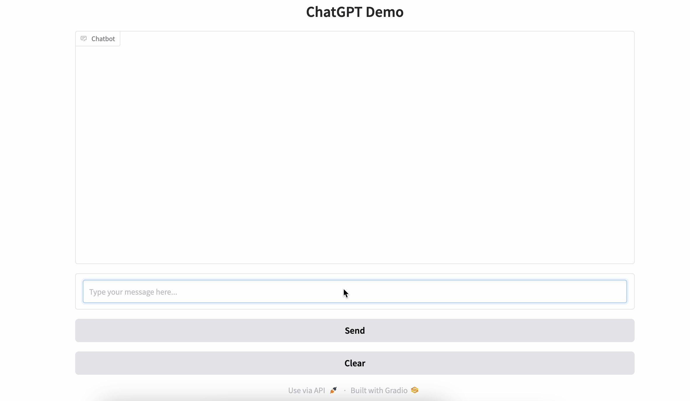
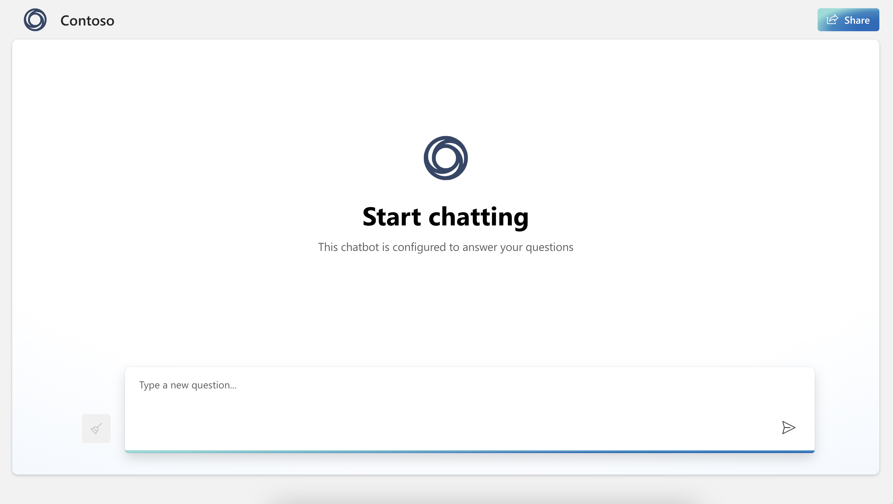

# Azure AI Search

This repository showcases the integration of **Azure OpenAI** services with **Gradio** to create interactive web applications for searching tourist attractions.

## Features
- **Gradio**: Provides an easy-to-use UI for deploying AI models.
- **Azure OpenAI**: Powers the backend with advanced text and image generation capabilities.
- **Web Application Example**: Interactive chatbot using Azure OpenAI.


## Dataset Source
The dataset on Namhae-gun's tourist attractions (2022) is provided by **Namhae-gun, Gyeongsangnam-do** via the [Korea Open Government Data Portal](https://www.data.go.kr/data/15110855/fileData.do?recommendDataYn=Y). It includes multilingual information such as names, addresses, coordinates, and contact details.


## Project Structure
   ```bash
   ├── dataset/           # Contains example datasets used in the project
   ├── demo/              # Includes media for showcasing the project
   │   └── demo.png       # Screenshot of the Gradio-based chatbot
   ├── gradio-chatbot.py  # Main script for running the Gradio application
   ```

## Demo
Below is a preview of the chatbot UI built using Gradio and Azure AI:





## Model Deployment and AI Search Setup

This project utilizes **Azure OpenAI Studio** and **Azure AI Search** for model deployment and interactive application development. Follow these concise steps to set up the infrastructure and integrate custom data.

---

### 1. Create a Resource Group in Azure Portal
- Log in to the [Azure Portal](https://portal.azure.com/).
- Search for **Resource Groups** and select **Create**.
- Enter a name, select your subscription and region, then click **Review + Create** and **Create**.

For detailed guidance, refer to [Manage resource groups - Azure portal](https://learn.microsoft.com/en-us/azure/azure-resource-manager/management/manage-resource-groups-portal).

---

### 2. Create an OpenAI Studio Resource
- Navigate to your resource group.
- Click **Create**, search for **Azure OpenAI**, and select **Create**.
- Configure the subscription, resource group, region, and name, then click **Review + Create** and **Create**.

Detailed instructions are available at [Create and deploy an Azure OpenAI Service resource](https://learn.microsoft.com/en-us/azure/ai-services/openai/how-to/create-resource).

---

### 3. Deploy a Model in OpenAI Studio
- Access your **Azure OpenAI** resource and open **OpenAI Studio**.
- Go to the **Deployments** tab and click **+ New Deployment**.
- Select a model, provide a deployment name, choose a pricing tier, and click **Create**.

For more information, see [Deploy models in Azure AI studio](https://learn.microsoft.com/en-us/azure/ai-studio/concepts/deployments-overview).

---

### 4. Set Up Azure AI Search
- In the Azure portal, search for **Azure Cognitive Search** and select **Create**.
- Configure the subscription, resource group, service name, region, and pricing tier, then click **Review + Create** and **Create**.

Refer to [Quickstart: Create an Azure Cognitive Search service in the portal](https://learn.microsoft.com/en-us/azure/search/search-create-service-portal) for detailed steps.

---

### 5. Add Custom Data to Azure AI Search
- In your **Azure Cognitive Search** service, navigate to **Data sources** and click **+ Add data source**.
- Choose the data source type (e.g., Azure Blob Storage), provide connection details, and define an index.
- Set up an indexer to load data from the data source into the index.

Detailed guidance is available at [Import data into Azure Cognitive Search](https://learn.microsoft.com/en-us/azure/search/search-import-data-portal).

---

By following these steps, you can effectively set up **Azure OpenAI Studio** and **Azure AI Search**, deploy models, and integrate custom data for robust AI-driven applications.

## How to Run
1. Clone the repository:
   ```bash
   git clone https://github.com/yourusername/azure-ai-search.git
   cd azure-ai-search
   ```
2. Install dependencies:
   ```bash
   pip install -r requirements.txt
   ```
    
3. Set up your Azure OpenAI credentials:
- Obtain an API key and endpoint from your Azure OpenAI subscription.
   ```bash
   AZURE_OPENAI_KEY=your_azure_openai_api_key
   AZURE_OPENAI_ENDPOINT=your_azure_openai_endpoint
   ```
4. Run the Gradio application:
   ```bash
   python gradio-chatbot.py
   ```

## License
This project is licensed under the [MIT License](LICENSE). You are free to use, modify, and distribute it as per the license terms.

## Acknowledgments
- [OpenAI](https://openai.com/) for their cutting-edge AI models.
- [Gradio](https://gradio.app/) for the intuitive UI framework.
- [Azure](https://azure.microsoft.com/) for hosting and API support.

