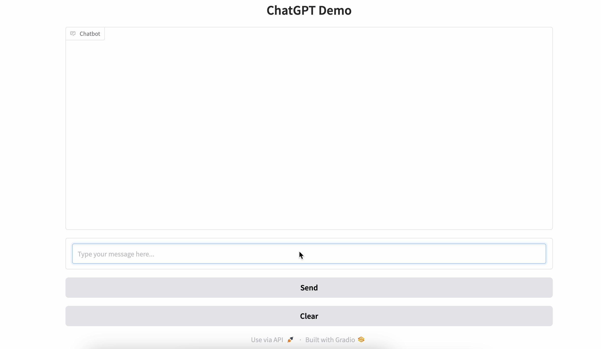

# Azure AI Search

This repository showcases the integration of **Azure OpenAI** services with **Gradio** to create interactive web applications for text and image processing.

## Features
- **Gradio**: Provides an easy-to-use UI for deploying AI models.
- **Azure OpenAI**: Powers the backend with advanced text and image generation capabilities.
- **Web Application Example**: Interactive chatbot using Azure OpenAI.

## Project Structure
   ```bash
   ├── dataset/           # Contains example datasets used in the project
   ├── demo/              # Includes media for showcasing the project
   │   └── demo.png       # Screenshot of the Gradio-based chatbot
   ├── gradio-chatbot.py  # Main script for running the Gradio application
   ```

## Demo
Below is a preview of the chatbot UI built using Gradio and Azure AI:



## How to Run
1. Clone the repository:
   ```bash
   git clone https://github.com/yourusername/azure-ai-search.git
   cd azure-ai-search
   ```
   
2. Set up your Azure OpenAI credentials:

   ```bash
   AZURE_OPENAI_KEY=your_azure_openai_api_key
   AZURE_OPENAI_ENDPOINT=your_azure_openai_endpoint
   ```

